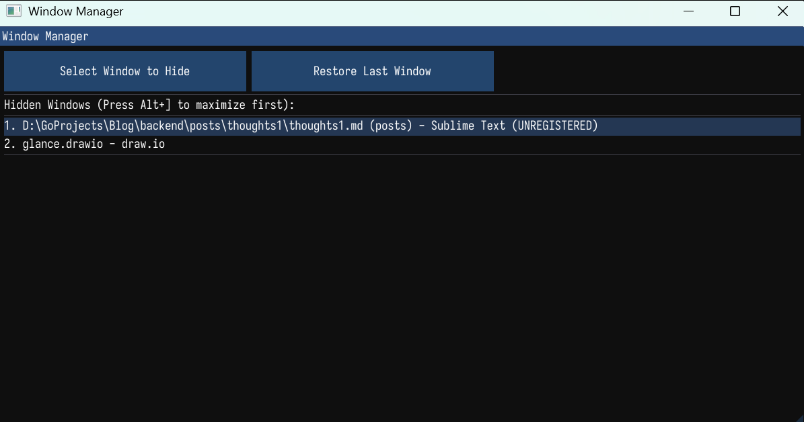

# Another Alt Tab

`Alt+Tab` is the Windows shortcut key for switching between windows. I usually only want 2-3 frequently used windows in this list so I can switch easily using `Alt+Tab`. However, I also have a dedicated window for managing notes and another for project construction drawing/diagramming. If I include all of them in the main `Alt+Tab` list, it disrupts the order of my normal working windows. Therefore, I developed this simple tool using ImGui and SDL3, which essentially creates a **new workspace**. Two window management spaces are just right; further division is unnecessary and would actually decrease efficiency.

## How to Compile

The environment is the MSVC development console. Use `python build.py all` to compile everything, or `python build.py main` to compile only `main.cpp` without compiling the ImGui source files (which only need to be compiled once).

## How to Use

After running the executable, a new application will appear in the system tray. Right-click to exit, or double-click the left mouse button to open the window manager:

1.  Clicking the **first button** changes the mouse cursor to a crosshair (this selection state disappears upon leaving the tool window, which I didn't bother to change—it's enough to show the selection state). You are now in window selection mode. Click on a window, and it will be converted into a floating toolbar and moved into our custom window management space. Press the left mouse button once or hit `Esc` to exit the selection mode.

2.  Clicking the **second button** returns the **last** window in our custom management space back to the main `Alt+Tab` list.

This software defaults to using **`Alt+]`** as its hotkey. You can use **`Alt+]`** to switch between the windows within our custom window management space, just like using `Alt+Tab`.

Additionally, when you exit the program by right-clicking the tray icon, **all** managed windows will be returned to the main `Alt+Tab` list.